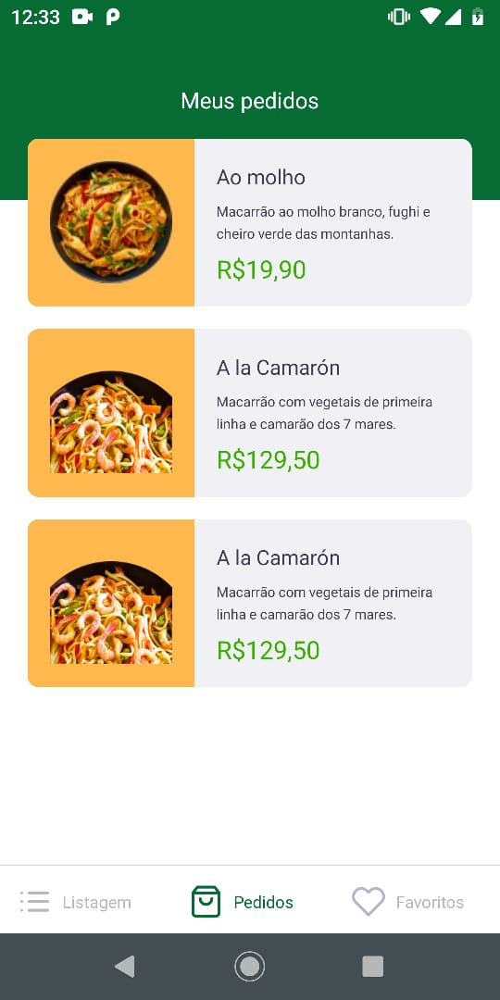
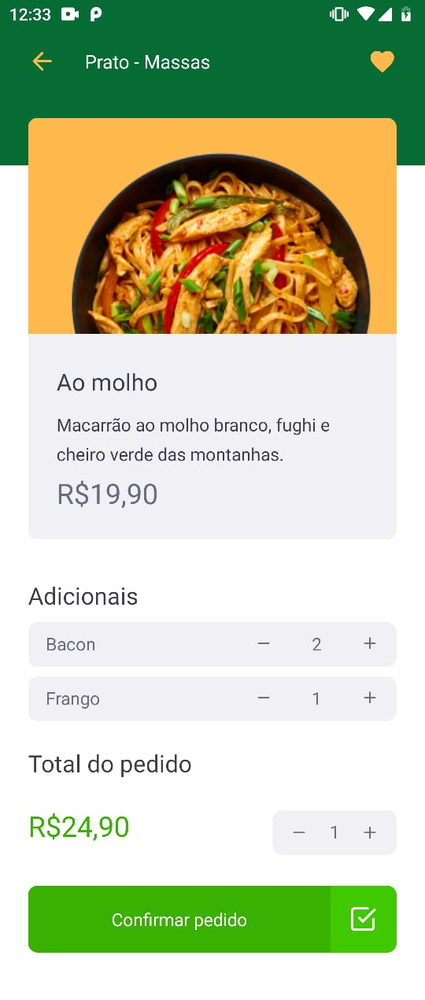

# App Delivery
&nbsp;&nbsp;&nbsp;&nbsp;
&nbsp;&nbsp;&nbsp;&nbsp;

## 💻 Projeto
<p>
Aplicativo desenvolvido em React Native usando TypeScript que permite o cliente fazer pedidos, favoritar comidas e visualizar pedidos anteriores. A aplicação usa uma api fake. 
</p>
&nbsp;&nbsp;&nbsp;&nbsp;

<p align="center">
  &nbsp;&nbsp;&nbsp;&nbsp;
  <kbd>
    
  </kbd>
  &nbsp;&nbsp;&nbsp;&nbsp;
</p>

##

<p align="center">
  &nbsp;&nbsp;&nbsp;&nbsp;
  <kbd>
    
  </kbd>
   &nbsp;&nbsp;&nbsp;&nbsp;
   <kbd>
    
  </kbd>
 &nbsp;&nbsp;&nbsp;&nbsp;
</p>


## 🚀 Tecnologias

- React Native
- TypeScript
- Context API
- Styled-components
- Json Server
- React Navigation
- React Native Vector Icons
- Axios
- ESLint
- Prettier
- Jest 

### Como executar o projeto

```bash

# Clone este repositório
$ git clone https://github.com/annemoraes/app-delivery.git

# Acesse a pasta do projeto no terminal/cmd
$ cd app-delivery

# Instale as dependências
$ yarn install

# Execute a api fake
$ yarn dev:server

# Execute a aplicação com emulador ou dispositivo físico conectado
$ react-native run-android

```
---


